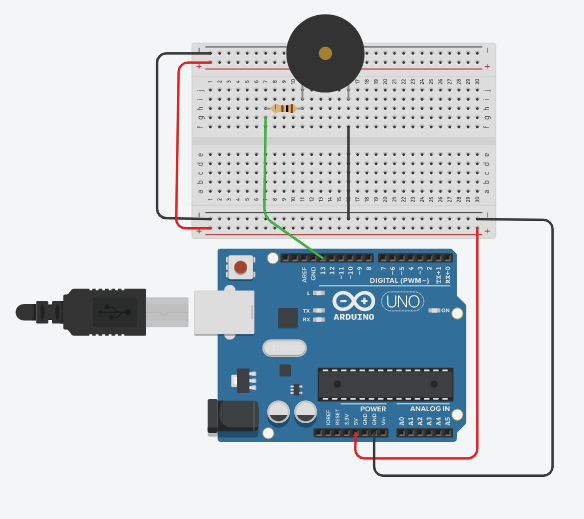
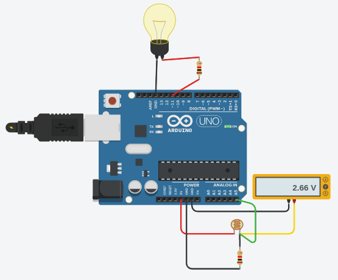
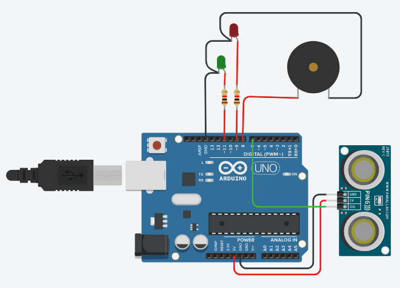
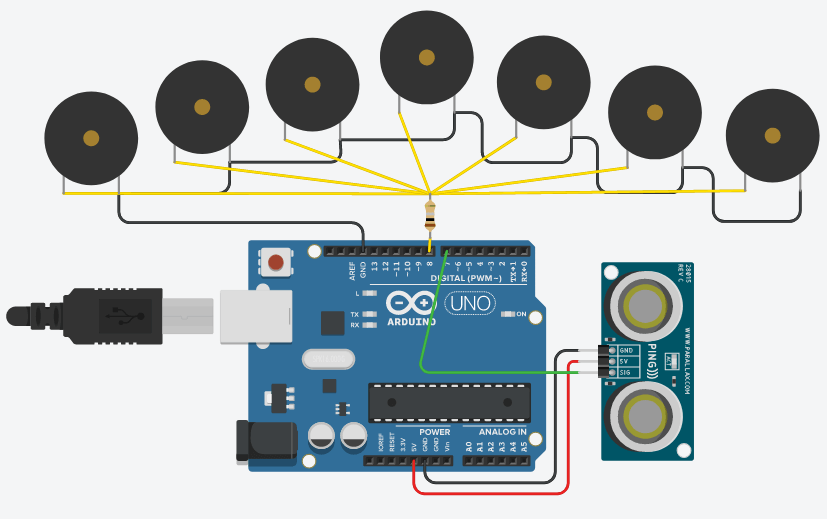

# Prácticas con Tinkercad
#### Por: Rafael R. Ramos R.

El siguiente es un resumen de las simulaciones realizadas en la plataforma Tinkercad con las placas Arduino.

## ALARMA
La simulación de la alarma tiene como fin construir un circuito capaz de generar un sonido estridente que sea facilmente persivido, pero que de especie de aviso antes de llegar a una frecuencia alta.
  
**Inicialización:**  
Usaremos al pin 13 como salida para activar el piezo de la alarma.
```c
void setup()
{
  pinMode(13, OUTPUT);
}
```
**Código:**  
El piezo será activado y apagado 2 veces, generando dos zumbidos suaves para avisar que la alarma se ha activado, posteriormente, la alarma procede a generar un sonido con frecuencia de 440 hertz durante 6 segundos. Finalmente, la alarma se silencia por 5 segundos y vuelve a repetir su ciclo.
```c
void loop()
{
  digitalWrite(13, HIGH);
  delay(1000);
  digitalWrite(13, LOW);
  delay(1000);
  digitalWrite(13, HIGH);
  delay(1000);
  digitalWrite(13, LOW);
  delay(1000);
  // @pin (int)
  // @frequency (hertz)
  // @duration (milliseconds)
  tone(13, 440, 6000);
  delay(6000);
  noTone(13);
  delay(5000);
}
```
***Nota:*** Para la realización de la simulación se hizo uso de la función `tone` que recibe el como parámetro el número del pin, la frecuencia de la onda y la duración de la misma. También se hace uso de la función `noTone` que detiene la generación de una onda producida por la función `tone`.  
[Simulación y código](https://www.tinkercad.com/things/4DCG0AANYr2-alarrrrma/editel?sharecode=3maesr8ELz2UN2-gCQ6qXkVj9XPugbTDmeHNtNMHh9Y)

## FAROLA
La simulación de la farola busca encender o apagar una bombilla según la variación de una fotoresistencia.
  
**Inicialización:**  
Usamos el pin 11 como salida para encender o apagar la bombilla de la farola.
```c
void setup()
{
  pinMode(11, OUTPUT);
}
```
**Código:**  
Leemos el pin A5 donde se encuentra conectado la terminal 2 de la fotoresistencia, dicho input nos obtendrá el valor de la intensidad de luz. Si el valor es superior a 400, se procede a encender la bombilla, caso contrario, se apagará la bombilla.
```c
void setup()
{
  if(analogRead(A5)>400){
    digitalWrite(11, HIGH);
  } else {
    digitalWrite(11, LOW);
  }
}
```
[Simulación y código](https://www.tinkercad.com/things/dGHKpPiZoQw-otrrrra-farrrrola/editel?sharecode=guvx37KHaJBqd2D_i6nmhJJ1S5gbQmb2aId2cvSe9NA)
## ULTRASONIDO
Esta simulación tiene como objetivo usar un sensor ultrasónico para detectar cuando un objeto está dentro o fuera de un rango determinado.  
  
**Variables globales:**  
Declaramos como entero la variable `cm` que almacenará la distancia entre el sensor y el objeto, también se crea la función `readUltrasonicDistance` que retornará el tiempo en microsegundos que tarda el eco del sensor en retornar. [Más detalles.](https://www.arduino.cc/en/Tutorial/BuiltInExamples/Ping)
```c
int cm = 0;
long readUltrasonicDistance(int triggerPin, int echoPin)
{
  pinMode(triggerPin, OUTPUT);  // Clear the trigger
  digitalWrite(triggerPin, LOW);
  delayMicroseconds(2);
  // Sets the trigger pin to HIGH state for 10 microseconds
  digitalWrite(triggerPin, HIGH);
  delayMicroseconds(10);
  digitalWrite(triggerPin, LOW);
  pinMode(echoPin, INPUT);
  // Reads the echo pin, and returns the sound wave travel time in microseconds
  return pulseIn(echoPin, HIGH);
}
```
**Inicialización:**  
Usamos los pines 9 y 11 como salida para encender o apagar los LEDs que indican si el objeto se encuentra dentro o fuera del campo visual, por otro lado, se usará el pin 8 para accionar el piezo que genera una alarma cada que no se detecte el objeto.
```c
void setup()
{
  pinMode(8, OUTPUT);
  pinMode(9, OUTPUT);
  pinMode(11, OUTPUT);
}
```
**Código:**  
Lo primero es obtener el valor en centímetros de la distancia entre el sensor y el objeto, cada que el objeto se encuentra fuera de rango el valor es igual a 336 cm, lo que nos permite crear una condicional que apague el LED verde y encienda el LED rojo junto con la alarma cuando la condición se cumpla. De no ser un valor igual a 336, el LED rojo y la alarma se apagan, encendiendo el LED verde.
```c
void setup()
{
  cm = 0.01723 * readUltrasonicDistance(7, 7);
  if(cm==336){
  	digitalWrite(11, LOW);
    digitalWrite(9, HIGH);
  	digitalWrite(8, HIGH);
  } else {
    digitalWrite(9, LOW);
  	digitalWrite(8, LOW);
  	digitalWrite(11, HIGH);
  }
  delay(100);
}
```
[Simulación y código](https://www.tinkercad.com/things/9ACwB2OBkbi-ultrrrrasonido/editel?sharecode=cg83uOm0PFVBBLqyX6PrXr1LdbrrpVC1fQ9n_hO1Ezw)
## THEREMIN
La finalidad de la simulación theremin es imitar el funcionamiento del instrumento musical con el mismo nombre.
  
**Inicialización:**  
Se define al pin 8 como salida para encender los piezos.
```c
void setup()
{
  pinMode(8, OUTPUT);
}
```
**Código:**  
Obtemos la distancia entre el objeto y el sensor que posteriormente será utilizada como el valor de la frecuencia de las notas musicales, la distancia se multiplica por dos (2) para alcanzar notas más altas.
```c
void setup()
{
  cm = 0.01723 * readUltrasonicDistance(7, 7);
  tone(8, cm * 2, 200);
}
```
**Nota:** Para esta simulación también se hace uso de la función global `readUltrasonicDistance`, explicada en el punto anterior.  
[Simulación y código](https://www.tinkercad.com/things/igPs8F1klfm-therrrremin/editel?sharecode=waQzvbzH-OXdJzUkgWVVRKrBLjaJxPzb_F6MxwMpKtc)
